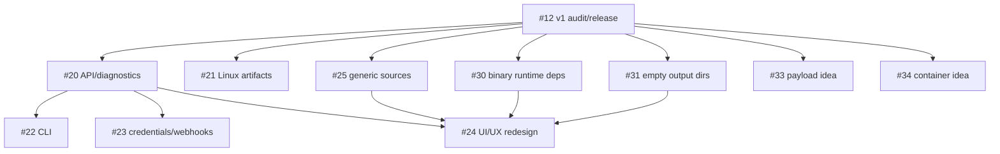

# DebBuilder roadmap

This is the canonical human-readable roadmap. GitHub Issues hold the detailed
scope and acceptance criteria; the [DebBuilder Project](https://github.com/users/ProBatou/projects/1)
tracks coordination state. The current public release is v0.5.0; v1 has not
been released. Post-v1 items describe intended work unless marked exploratory.

**Dependency key:** `A → B` means B waits for A. Coordination means the teams
should align a contract or release surface, without imposing an order. Work in
different branches can proceed in parallel once its own prerequisites are met.

## v1 — current

- [#12 Final v1 audit and release](https://github.com/ProBatou/DebBuilder/issues/12)
  is in progress. Its earlier runtime, source, automation, architecture and
  APT epoch fixes are completed foundations, not active blockers. The audit,
  version decision and release are still pending.

## Post-v1 foundations and product capabilities

These can advance in parallel after #12:

| Issue | Outcome | Further dependency |
| --- | --- | --- |
| [#20 System diagnostics, support bundle and documented API](https://github.com/ProBatou/DebBuilder/issues/20) | Stable operator and API contracts for later clients, integrations and UI | Opens #22, #23 and #24 |
| [#25 Generic Git repositories and direct archive URLs](https://github.com/ProBatou/DebBuilder/issues/25) | A source model beyond GitHub that preserves #28's resolved-source semantics | Opens #24 |
| [#30 Runtime shared-library dependencies for prebuilt binaries](https://github.com/ProBatou/DebBuilder/issues/30) | Safe inspection and explainable Debian `Depends` proposals, using completed #27/#28 foundations | Opens #24; coordinates with #25 on source-neutral metadata |
| [#31 Explicit empty output directories](https://github.com/ProBatou/DebBuilder/issues/31) | Declarative post-build directory preparation with fail-closed paths | Opens #24's final Recipe/output UX |

## UI/UX redesign

- [#24 Interface redesign and frontend architecture review](https://github.com/ProBatou/DebBuilder/issues/24)
  waits for **#20, #25, #30 and #31**. Those Issues establish the API,
  source, binary-dependency and output models the redesigned interface must
  explain. #22, #23 and #21 are not prerequisites. Begin #24 with its stated
  UX and architecture audit before implementation.

## Distribution, developer tools and integrations

- [#21 Self-contained Linux artifacts and multi-arch bundles](https://github.com/ProBatou/DebBuilder/issues/21)
  is a post-v1 distribution branch after #12. The `.deb` stays canonical.
  Coordinate version/capability reporting with #20, CLI distribution with
  #22, and architecture/release choices with #34; it does not block #24.
- [#22 Official CLI](https://github.com/ProBatou/DebBuilder/issues/22)
  consumes the documented API from #20. Coordinate authentication with #23
  and distribution with #21. It can proceed alongside #23 and #24.
- [#23 Scoped API credentials and webhooks](https://github.com/ProBatou/DebBuilder/issues/23)
  consumes the documented API and event/error contracts from #20. Coordinate
  CLI authentication with #22 and automation events with completed #14. It
  can proceed alongside #22 and #24.

## Exploratory / v2 ideas

These are post-v1 audit, design and prototype topics, not commitments to ship.
They do not block #24 or any v1 work.

- [#33 Alternative application payload strategies](https://github.com/ProBatou/DebBuilder/issues/33)
  explores application trees, native/upstream binaries, bundles and SquashFS.
  Coordinate with #21 on bundling lessons, #25 on source/payload boundaries,
  #30 on prebuilt-binary dependencies and #24 if a strategy earns a product UX.
  No hard dependency on those Issues is assumed for the audit.
- [#34 Containerized / Portainer deployment](https://github.com/ProBatou/DebBuilder/issues/34)
  audits OCI packaging, single-container versus control-plane/Validation-runner
  designs, persistent repository/GPG state and GHCR release integration.
  Coordinate with #21 on multi-arch/distribution and the release process on
  GHCR; involve #24 only if a real operator workflow calls for UI changes.
  The canonical `.deb`/VM deployment and v1 scope remain intact.

## Dependency graph

Arrows are the hard release/implementation gates. #20, #25, #30 and #31 are
independent of one another; #21 is independent of #24; #22 and #23 do not
block each other or #24. Coordination relationships are described above and
are deliberately absent from the hard-dependency graph.

## Completed foundations

The completed async/runtime/recovery, shutdown, repository locking, retention,
resource-limit, automation, architecture and packaging work remains part of
the current baseline. In particular, [#14](https://github.com/ProBatou/DebBuilder/issues/14),
[#19](https://github.com/ProBatou/DebBuilder/issues/19),
[#27](https://github.com/ProBatou/DebBuilder/issues/27),
[#28](https://github.com/ProBatou/DebBuilder/issues/28) and
[#32](https://github.com/ProBatou/DebBuilder/issues/32) are closed. They are
not active blockers of #12 or post-v1 work; later Issues must preserve their
relevant contracts.
