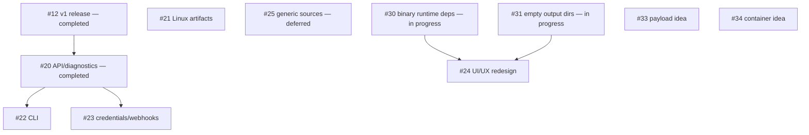

# DebBuilder roadmap

This is the canonical human-readable roadmap. GitHub Issues hold the detailed
scope and acceptance criteria; the [DebBuilder Project](https://github.com/users/ProBatou/projects/1)
tracks coordination state. The current public release is **v1.0.0**. Post-v1
items describe intended work unless marked exploratory.

**Dependency key:** `A → B` means B waits for A. Coordination means the teams
should align a contract or release surface, without imposing an order. Work in
different branches can proceed in parallel once its own prerequisites are met.

## v1 — completed

- [#12 Final v1 audit and release](https://github.com/ProBatou/DebBuilder/issues/12)
  is complete. v1.0.0 is released and remains the stable baseline for post-v1
  work.

## Post-v1 foundations and product capabilities

The release gate is open and these tracks can advance independently unless a
specific dependency is stated:

| Issue | Status | Outcome / roadmap role |
| --- | --- | --- |
| [#20 System diagnostics, support bundle and documented API](https://github.com/ProBatou/DebBuilder/issues/20) | **Completed** | Stable operator/API contracts. #22 and #23 can build on it; #24 can consume the established API/diagnostic surface. |
| [#25 Generic Git repositories and direct archive URLs](https://github.com/ProBatou/DebBuilder/issues/25) | **Deferred after audit** | The source abstraction was audited, but implementation is intentionally postponed while real usage remains GitHub-only. Revisit when a concrete non-GitHub source need appears. It no longer blocks #24. |
| [#30 Runtime shared-library dependencies for prebuilt binaries](https://github.com/ProBatou/DebBuilder/issues/30) | **In progress — audit/prototype** | Safe ELF inspection and explainable Debian `Depends` proposals for prebuilt binaries. Must settle before #24 so the dependency UX reflects real backend capability. |
| [#31 Explicit empty output directories](https://github.com/ProBatou/DebBuilder/issues/31) | **In progress — audit/design** | Declarative post-build directory preparation with fail-closed path handling. Must settle before #24 so the output UX models this lifecycle explicitly. |

#30 and #31 are currently being audited in parallel. Their implementation
should remain independent; if both later touch Recipe schema/serialization,
integrate one cleanly before rebasing/resyncing the other.

## UI/UX redesign

- [#24 Interface redesign and frontend architecture review](https://github.com/ProBatou/DebBuilder/issues/24)
  waits for **#30 and #31**. #20 is already complete. #25 has been deliberately
  deferred and is no longer a prerequisite: the redesign may target the real
  current GitHub source workflow and leave room for future source providers
  without implementing them speculatively. #21, #22 and #23 are not
  prerequisites. Begin #24 with its stated UX/frontend architecture audit and
  design-direction proposal before implementation.

## Distribution, developer tools and integrations

- [#21 Self-contained Linux artifacts and multi-arch bundles](https://github.com/ProBatou/DebBuilder/issues/21)
  is an independent post-v1 distribution branch. The `.deb` stays canonical.
  Coordinate version/capability reporting with completed #20, CLI distribution
  with #22, and architecture/release choices with #34; it does not block #24.
- [#22 Official CLI](https://github.com/ProBatou/DebBuilder/issues/22)
  can now consume the documented API from completed #20. Coordinate
  authentication with #23 and distribution with #21. It does not block #24.
- [#23 Scoped API credentials and webhooks](https://github.com/ProBatou/DebBuilder/issues/23)
  can now build on the documented API and event/error contracts from completed
  #20. Coordinate CLI authentication with #22 and automation events with
  completed #14. It does not block #24.

## Exploratory / v2 ideas

These are post-v1 audit, design and prototype topics, not commitments to ship.
They do not block #24.

- [#33 Alternative application payload strategies](https://github.com/ProBatou/DebBuilder/issues/33)
  explores application trees, native/upstream binaries, bundles and SquashFS.
  Coordinate with #21 on bundling lessons, #25 if source/payload boundaries are
  revisited, #30 on prebuilt-binary dependencies and #24 if a strategy earns a
  product UX. No hard dependency on those Issues is assumed for the audit.
- [#34 Containerized / Portainer deployment](https://github.com/ProBatou/DebBuilder/issues/34)
  audits OCI packaging, single-container versus control-plane/Validation-runner
  designs, persistent repository/GPG state and GHCR release integration.
  Coordinate with #21 on multi-arch/distribution and the release process on
  GHCR; involve #24 only if a real operator workflow calls for UI changes.
  The canonical `.deb`/VM deployment remains unchanged.

## Dependency graph

Arrows are current hard implementation gates. #12 and #20 are completed
historical foundations. #25 remains available as future source-expansion work
but is deliberately not a hard gate for #24. #21, #22 and #23 do not block the
redesign. Coordination relationships are described above and are deliberately
absent from the hard-dependency graph.

## Completed foundations

The completed async/runtime/recovery, shutdown, repository locking, retention,
resource-limit, automation, architecture, source correctness, validation and
packaging work remains part of the baseline. In particular,
[#12](https://github.com/ProBatou/DebBuilder/issues/12),
[#14](https://github.com/ProBatou/DebBuilder/issues/14),
[#19](https://github.com/ProBatou/DebBuilder/issues/19),
[#20](https://github.com/ProBatou/DebBuilder/issues/20),
[#27](https://github.com/ProBatou/DebBuilder/issues/27),
[#28](https://github.com/ProBatou/DebBuilder/issues/28) and
[#32](https://github.com/ProBatou/DebBuilder/issues/32) are closed. Later work
must preserve their relevant contracts.
