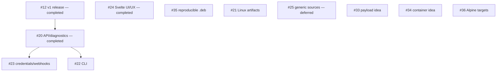

# DebBuilder roadmap

This is the canonical human-readable roadmap. GitHub Issues hold the detailed
scope and acceptance criteria; the [DebBuilder Project](https://github.com/users/ProBatou/projects/1)
tracks coordination state. The current public release is **v1.1.0**. Post-v1
items describe intended work unless marked exploratory.

**Dependency key:** `A → B` means B waits for A. Coordination means the teams
should align a contract or release surface, without imposing an order. Work in
different branches can proceed in parallel once its own prerequisites are met.

## Released baselines

- [#12 Final v1 audit and release](https://github.com/ProBatou/DebBuilder/issues/12)
  is complete. v1.0.0 established the stable Debian package, runtime, Validation,
  Publication and release baseline.
- [#24 Interface redesign and frontend architecture review](https://github.com/ProBatou/DebBuilder/issues/24)
  is complete and delivered in v1.1.0. The Svelte administration frontend,
  responsive operator UX, migrated actions and production package/static cutover
  are integrated. The canonical `.deb`/systemd deployment remains unchanged.

## Post-v1 foundations and product capabilities

| Issue | Status | Outcome / roadmap role |
| --- | --- | --- |
| [#20 System diagnostics, support bundle and documented API](https://github.com/ProBatou/DebBuilder/issues/20) | **Completed** | Stable operator/API contracts. #22 and #23 can build on it. |
| [#24 UI/UX redesign and Svelte frontend](https://github.com/ProBatou/DebBuilder/issues/24) | **Completed** | Production-packaged Svelte frontend and operator workflow redesign shipped in v1.1.0. |
| [#25 Generic Git repositories and direct archive URLs](https://github.com/ProBatou/DebBuilder/issues/25) | **Deferred** | The source abstraction was audited, but implementation is intentionally postponed while real usage remains GitHub-only. Revisit when a concrete non-GitHub source need appears. |
| [#30 Runtime shared-library dependencies for prebuilt binaries](https://github.com/ProBatou/DebBuilder/issues/30) | **Completed** | Bounded ELF inspection, Bookworm/amd64 Debian dependency resolution, opt-in Recipe packaging and offline Validation are integrated. |
| [#31 Explicit empty output directories](https://github.com/ProBatou/DebBuilder/issues/31) | **Completed** | Declarative post-build directory preparation with fail-closed path handling, empty-directory staging and operator diagnostics is implemented. |
| [#35 Reproducible Debian artifacts](https://github.com/ProBatou/DebBuilder/issues/35) | **See Project** | Require byte-identical official `.deb` candidates from identical tagged source and immutable inputs under the supported release toolchain. |

## Current development direction

The [#35](https://github.com/ProBatou/DebBuilder/issues/35) release-engineering
track defines a stable `SOURCE_DATE_EPOCH`, normalizes package/archive timestamps
and compression, and requires two clean builds to produce the same `.deb` SHA-256.

After that, the integration/client tracks can advance independently:

- [#23 Scoped API credentials and webhooks](https://github.com/ProBatou/DebBuilder/issues/23)
  builds on the documented API and event/error contracts from completed #20.
  Machine credentials should define the authentication contract reused by
  automation and coordinated with #22.
- [#22 Official CLI](https://github.com/ProBatou/DebBuilder/issues/22)
  consumes the public API rather than server internals. Coordinate CLI
  authentication with #23 and distribution with #21.
- [#21 Self-contained Linux artifacts and multi-arch bundles](https://github.com/ProBatou/DebBuilder/issues/21)
  is an independent distribution track. The `.deb` remains canonical; coordinate
  reproducibility/release lessons with #35, CLI distribution with #22, and
  architecture choices with #34.

These tracks do not require reopening #24. Any UI additions discovered during
real production use should be handled as focused follow-up Issues.

## Deferred source expansion

[#25 Generic Git repositories and direct archive URLs](https://github.com/ProBatou/DebBuilder/issues/25)
remains deliberately deferred. Current real usage is GitHub-based, and the
v1.1.0 frontend was designed so future source providers can be added without
pretending unsupported providers already exist. Resume #25 when an actual
non-GitHub repository/archive use case appears.

## Exploratory / v2 ideas

These are audit, design and prototype topics, not commitments to ship.

- [#33 Alternative application payload strategies](https://github.com/ProBatou/DebBuilder/issues/33)
  explores application trees, native/upstream binaries, bundles and SquashFS.
  Coordinate with #21 on bundling lessons, #25 if source/payload boundaries are
  revisited, and #30 on prebuilt-binary dependencies.
- [#34 Containerized / Portainer deployment](https://github.com/ProBatou/DebBuilder/issues/34)
  audits OCI packaging, single-container versus control-plane/Validation-runner
  designs, persistent repository/GPG state and GHCR release integration. The
  canonical `.deb`/VM deployment remains the reference model.
- [#36 Multi-distribution targets with Alpine `.apk`](https://github.com/ProBatou/DebBuilder/issues/36)
  explores a future packaging-target abstraction across Debian and Alpine,
  including musl compatibility, OpenRC, Alpine dependency mapping and APK
  repository publication. This is a larger v2 direction and is not part of the
  current Debian release track.

## Dependency graph

```mermaid
flowchart TD
    I12["#12 v1 release — completed"]
    I20["#20 API/diagnostics — completed"]
    I24["#24 Svelte UI/UX — completed"]
    I35["#35 reproducible .deb"]
    I21["#21 Linux artifacts"]
    I23["#23 credentials/webhooks"]
    I22["#22 CLI"]
    I25["#25 generic sources — deferred"]
    I33["#33 payload idea"]
    I34["#34 container idea"]
    I36["#36 Alpine targets"]

    I12 --> I20
    I20 --> I23
    I20 --> I22
```

Arrows are hard implementation gates only. #35 and #21 are independent
post-v1 release/distribution work. #22 can technically advance from #20, while
#23 and #22 should coordinate the machine-authentication contract. #25 remains
available as future source-expansion work but is intentionally not a gate.
#33, #34 and #36 are exploratory/v2 tracks.

## Completed foundations

The completed async/runtime/recovery, shutdown, repository locking, retention,
resource-limit, automation, architecture, source correctness, validation,
packaging and frontend work remains part of the baseline. In particular,
[#12](https://github.com/ProBatou/DebBuilder/issues/12),
[#14](https://github.com/ProBatou/DebBuilder/issues/14),
[#19](https://github.com/ProBatou/DebBuilder/issues/19),
[#20](https://github.com/ProBatou/DebBuilder/issues/20),
[#24](https://github.com/ProBatou/DebBuilder/issues/24),
[#27](https://github.com/ProBatou/DebBuilder/issues/27),
[#28](https://github.com/ProBatou/DebBuilder/issues/28),
[#30](https://github.com/ProBatou/DebBuilder/issues/30),
[#31](https://github.com/ProBatou/DebBuilder/issues/31) and
[#32](https://github.com/ProBatou/DebBuilder/issues/32) are closed. Later work
must preserve their relevant contracts.
